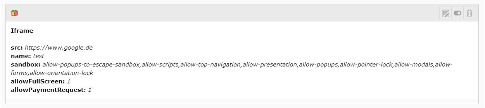

.. include:: ../Includes.txt

Iframe content element
======================

The element is selectable under the tab "special" in the new content element wizard.

Main settings
-------------

.. ### BEGIN~OF~TABLE ###

.. container:: table-row

   Property
         Src

   Data type
         string (mandatory)

   Description
         The url of the iframe. (The host will be added to the csp header from this url)

   Example
         https://www.test.de

.. container:: table-row

   Property
         Name

   Data type
         string

   Description
         Name attribute of the iframe tag.

.. container:: table-row

   Property
         Allow full screen mode

   Data type
         checkbox

   Description
         If this checkbox isn't checked, the element can't be placed into full screen mode.

.. container:: table-row

   Property
         Allow payment methods

   Data type
         checkbox

   Description
         This attribute can be set to true if the contents of a cross-origin <iframe>
         should be allowed to invoke the Payment Request API.

         More info: https://developer.mozilla.org/en-US/docs/Web/API/Payment_Request_API

         .. attention::

            This is yet only experimental!

.. container:: table-row

   Property
         Data attributes

   Data type
         string

   Description
         Data attributes for the iframe tag. These field requires a special format:
         attr_name: attr_value; Attribute name is always required, values are optional.
         Name and values are always separated with ":". Empty attributes are allowed.
         A definition of one attribute ends with semicolon. Multiple attributes may defined in the field.
         Data prefix is not necessary (like data-test), but can be used. If no prefix is there,
         "data-" will be added automatically.

   Example
         One attribute with two values, without data- prefix, and a second attribute without value:
         *test: value1, value2; data-test2;*
         This will result the following output:
         *data-test="value1 value" data-test2*

.. ###### END~OF~TABLE ######

Style settings
--------------

.. ### BEGIN~OF~TABLE ###

.. container:: table-row

   Property
         Class

   Data type
         string

   Description
         Space separated list of classes

   Example
         class1 class2 class3

.. container:: table-row

   Property
         Height

   Data type
         integer

   Description
         A positive integer value what describes the height of the iframe tag in pixel.
         If it has a value of 0 the attribute won't be add.

   Example
         600

.. container:: table-row

   Property
         Width

   Data type
         integer

   Description
         A positive integer value what describes the width of the iframe tag in pixel.
         If it has a value of 0 the attribute won't be add.

   Example
         800

.. ###### END~OF~TABLE ######
